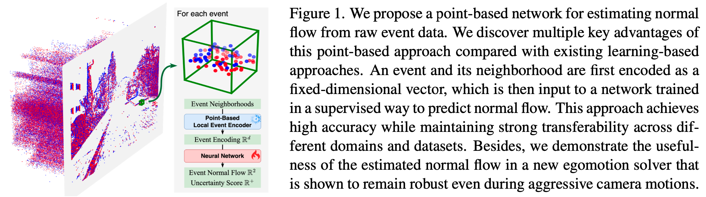
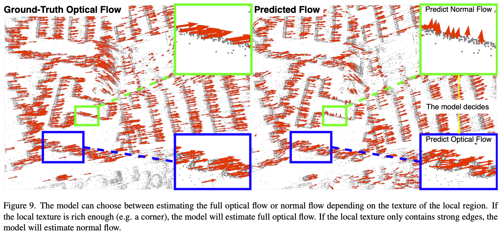
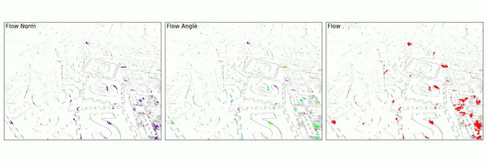
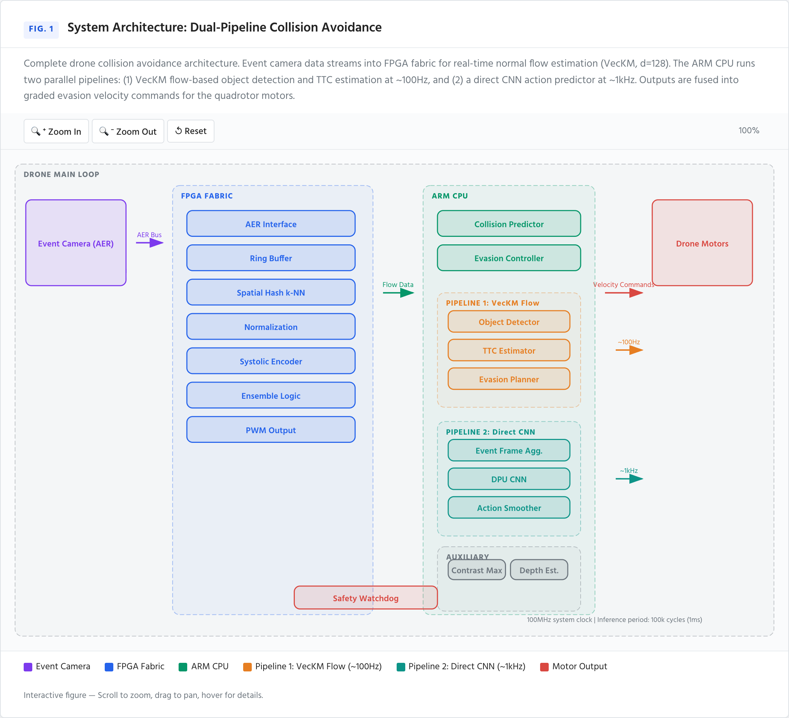
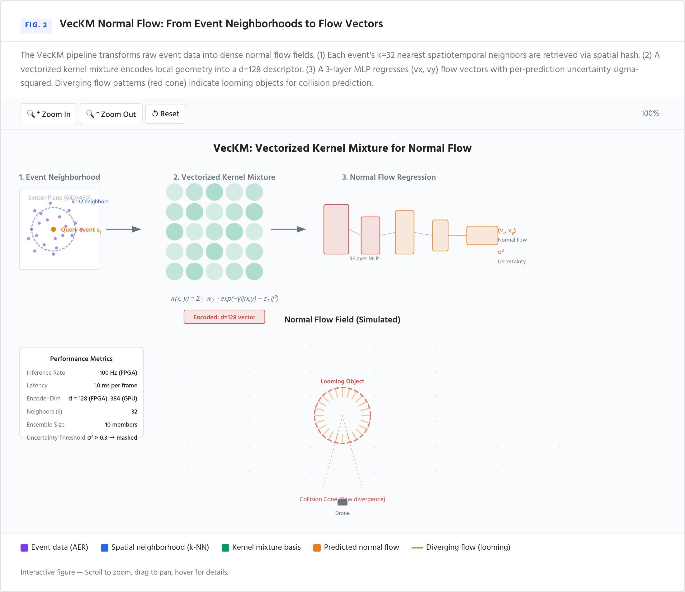
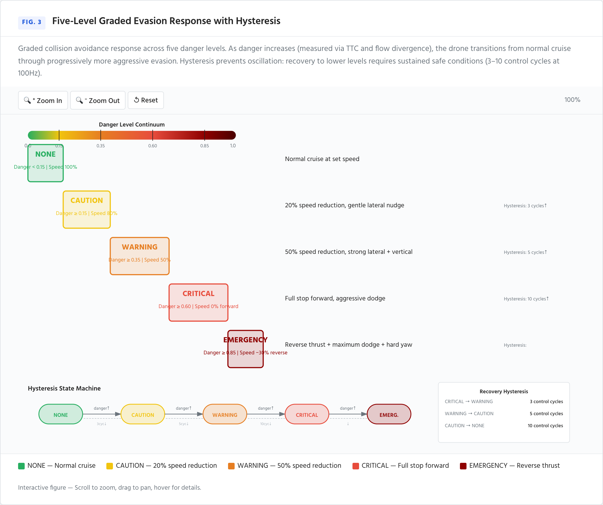
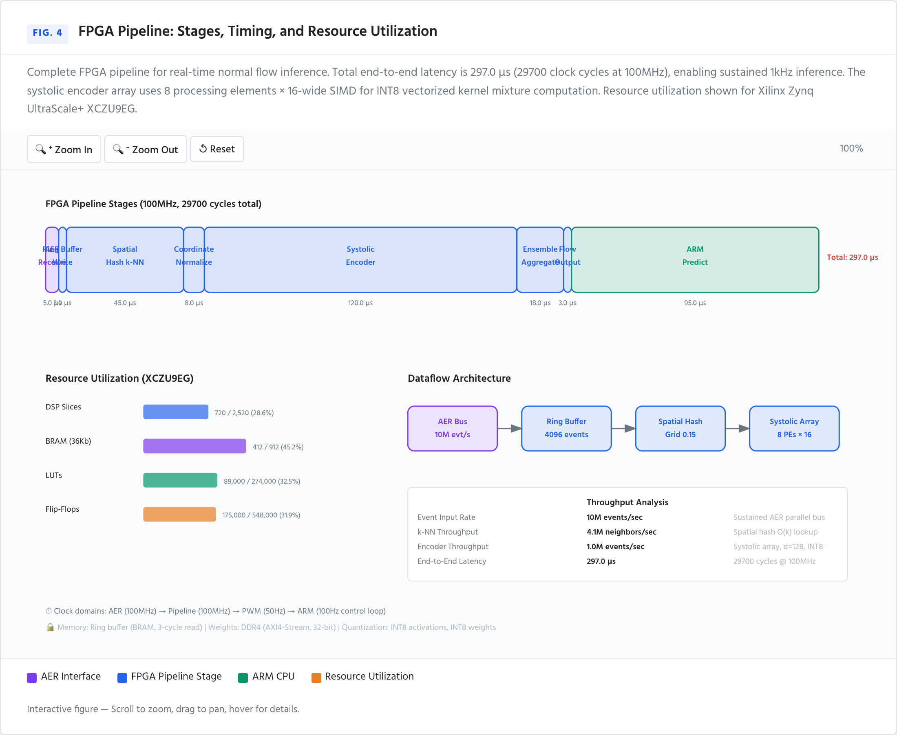
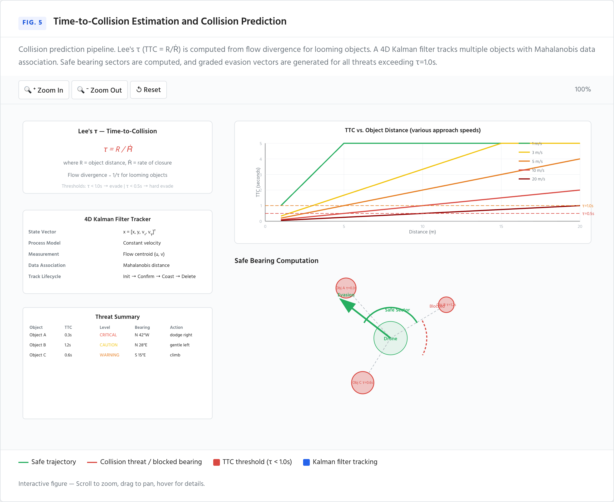
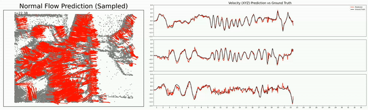

<h1 align='center' style="text-align:center; font-weight:bold; font-size:2.0em;letter-spacing:2.0px;"> FPGA Event-Based Drone Collision Avoidance </h1>

<p align='center' style="text-align:center;font-size:1.15em;">
    Real-time obstacle detection and evasion for drones using event cameras,<br>
    normal flow estimation, and FPGA-accelerated inference.
    <br><br>
    <a href="https://arxiv.org/abs/2412.11284" target="_blank" style="text-decoration: none;">[VecKM Paper (ICCV 2025)]</a> &nbsp;&nbsp;
    <a href="https://arxiv.org/pdf/2504.10400" target="_blank" style="text-decoration: none;">[Bonazzi et al. (CVPRW 2025)]</a> &nbsp;&nbsp;
    <a href="https://github.com/dhyuan99/VecKM_flow_cpp" target="_blank" style="text-decoration: none;">[VecKM C++ Reference]</a>
</p>

## Abstract

Event cameras capture per-pixel brightness changes asynchronously at microsecond resolution, making them ideal for high-speed drone navigation. This codebase combines a vectorized kernel mixture (VecKM) normal flow estimator with a production-grade FPGA + ARM pipeline to detect looming objects, predict time-to-collision, and execute graded evasion maneuvers — all in real time.

<div align="center">

</div>

<div align="center">

</div>

<div align="center">

</div>

---

## Interactive Figures 🖱️

Nature-journal-style self-contained HTML figures with SVG vector graphics, hover tooltips, zoom/pan, and responsive layout. **Click any image to open the interactive version** — scroll to zoom, drag to pan, hover for details.

### Fig. 1 — System Architecture
<a href="figures/fig1_architecture.html"></a>

*Dual-pipeline collision avoidance: Event Camera → FPGA Fabric (AER interface, ring buffer, spatial hash, systolic encoder) → ARM CPU (VecKM flow ~100Hz + CNN ~1kHz) → Motors*

### Fig. 2 — VecKM Normal Flow Estimation
<a href="figures/fig2_normal_flow.html"></a>

*3-step pipeline: k-NN event neighborhood → vectorized kernel mixture encoding (d=128) → MLP flow regression. Simulated diverging flow field with looming object collision cone.*

### Fig. 3 — Five-Level Graded Evasion Response
<a href="figures/fig3_evasion_levels.html"></a>

*Graded danger response (NONE → CAUTION → WARNING → CRITICAL → EMERGENCY) with hysteresis state machine and recovery thresholds.*

### Fig. 4 — FPGA Pipeline Timing & Resources
<a href="figures/fig4_fpga_pipeline.html"></a>

*Stage latency breakdown (~297 μs total, 100MHz), XCZU9EG resource utilization (DSP/BRAM/LUT/FF), dataflow architecture, throughput analysis.*

### Fig. 5 — TTC & Collision Prediction
<a href="figures/fig5_ttc_prediction.html"></a>

*Lee's τ time-to-collision (τ = R/Ṙ), TTC vs. distance curves, 4D Kalman filter tracker, safe bearing sector with evasion vector.*

> **🖱️ Interact:** Scroll = zoom | Drag = pan | Hover colored elements = annotation tooltips | Works on desktop + mobile
> 
> Generated by [`figures/generate_figures.py`](figures/generate_figures.py). PNG previews via [`figures/screenshot_figures.js`](figures/screenshot_figures.js).

---

## VecKM Normal Flow API

The underlying normal flow estimator can also be used standalone:

```python
from models.inference import NormalFlowEstimator
from models.visualize import gen_flow_video

estimator = NormalFlowEstimator(training_set="UNION")
flow_predictions, flow_uncertainty = estimator.inference(events_t, undistorted_events_xy)
flow_predictions[flow_uncertainty > 0.3] = np.nan

gen_flow_video(events_t.numpy(), undistorted_events_xy.numpy(),
               flow_predictions.numpy(), './frames', './output.mp4', fps=30)
```

| Variable | Description | Shape |
|----------|-------------|-------|
| `events_t` | Sorted event timestamps (seconds) | `(n,)` float64 |
| `undistorted_events_xy` | Undistorted normalized coordinates (~[-1, 1]) | `(n, 2)` float32 |
| `flow_predictions` | Predicted normal flow (undist. normalized px/s) | `(n, 2)` float32 |
| `flow_uncertainty` | Prediction uncertainty | `(n,)` float32 ≥ 0 |

Training sets: `"UNION"` (default, recommended), `"MVSEC"`, `"DSEC"`, `"EVIMO"`.

### Undistorted Coordinates

```python
import cv2

def get_undistorted_events_xy(raw_events_xy, K, D):
    raw_events_xy = raw_events_xy.astype(np.float32)
    undistorted = cv2.undistortPoints(raw_events_xy.reshape(-1, 1, 2), K, D)
    return undistorted.reshape(-1, 2)
```

---

## Egomotion Estimation

SVM-based egomotion estimator using predicted normal flow and IMU. See [`./egomotion`](./egomotion).

<div align="center">

</div>

---

## Architecture

Two complementary collision avoidance pipelines run in parallel:

```
┌──────────────────────────────────────────────────────────────────────────┐
│                              DRONE MAIN LOOP                             │
│                                                                          │
│  Event Camera (AER) ──────► FPGA Fabric ──────► ARM CPU ────► Motors     │
│       │                        │                    │                    │
│       │                     ┌───┴──────────┐    ┌───┴─────────────┐     │
│       │                     │  encoder       │    │  collision_pred │     │
│       │                     │  spatial_hash  │    │  evasion_ctrl   │     │
│       │                     │  ring_buf      │    │  safety_wdog    │     │
│       │                     │  normalization │    │  PWM output     │     │
│       │                     └────────────────┘    └─────────────────┘     │
│       │                                                                  │
│       │  PIPELINE 1: Flow-Based (VecKM, ~100Hz)                          │
│       │  ┌────────────────┐   ┌──────────────┐   ┌───────────────────┐  │
│       │  │ ObjectDetector  │──►│ CollisionPred │──►│ EvasionController │  │
│       │  │ (VecKM flow +   │   │ (TTC+threats) │   │ (graded velocity) │  │
│       │  │  clustering)    │   └──────────────┘   └───────────────────┘  │
│       │  └────────────────┘                                             │
│       │                                                                  │
│       │  PIPELINE 2: Direct CNN (Bonazzi 2025, ~1kHz)                    │
│       │  ┌─────────────────┐   ┌───────────────────┐                     │
│       │  │ EventFrameAgg   │──►│ DirectActionPred  │                     │
│       │  │ (80x80 @ 1kHz)  │   │ (DPU CNN 5-class) │                     │
│       │  └─────────────────┘   └───────────────────┘                     │
│       │                                                                  │
│       │  AUXILIARY MODULES                                               │
│       │  ┌──────────────────┐ ┌────────────────┐ ┌────────────────────┐ │
│       │  │ ContrastMaximizer │ │ DepthEstimator │ │ DenseTTCEstimator  │ │
│       │  │ (CMax-SLAM, 2018) │ │ (E2Depth, 2020)│ │ (EVReflex, 2021)  │ │
│       │  └──────────────────┘ └────────────────┘ └────────────────────┘ │
│       │                                                                  │
└──────────────────────────────────────────────────────────────────────────┘
```

---

## Quick Start

```bash
# Install
git clone https://github.com/Enotrium/FPGA-Event-Based-encode
cd FPGA-Event-Based-encode
make install

# Convert pretrained weights (d=384 → d=128 for FPGA)
make convert

# Run all tests (no hardware needed)
make test

# Run end-to-end simulation with visualization
python test/test_fpga_simulator.py --visualize

# Run hardware-in-the-loop simulation (no physical drone needed)
make test-hil

# Run the drone demo
cd demo && python main.py
```

---

## Directory Layout

| Directory | Purpose |
|-----------|---------|
| [`fpga/`](./fpga/) | HLS/C++ FPGA modules: AER interface, ring buffer, normalization, spatial hash k-NN, systolic encoder array, PWM output, top-level pipeline, testbench |
| [`arm/`](./arm/) | ARM C++ controller: collision predictor (TTC + clustering), evasion controller (potential fields + hysteresis), safety watchdog (RC failsafe, NaN guard, altitude ceiling), Kalman filter object tracker, MAVLink v2 PX4 bridge, main control loop |
| [`drone/`](./drone/) | Python drone control package: dual-pipeline controller, VecKM object detector, collision predictor, evasion controller, dense TTC estimator, event frame aggregator, direct CNN action predictor, contrast maximizer, monocular depth estimator |
| [`models/`](./models/) | VecKM normal flow estimator: local geometry encoder, feature transform, inference API with ring buffer + FPGA mode, model parameters |
| [`train/`](./train/) | Training pipeline: dataset loaders, model definition, training loop, inference, visualization, FPGA weight conversion, d=128 training config |
| [`test/`](./test/) | Test suite: Python FPGA pipeline simulator (5 scenarios), ARM C++ collision prediction + evasion controller unit tests, golden model equivalence checks (FPGA ↔ Python), hardware-in-the-loop simulation (PX4 SITL/AirSim/built-in) |
| [`demo/`](./demo/) | Demo: event data, frames, flow visualization |
| [`egomotion/`](./egomotion/) | SVM-based egomotion estimation from normal flow + IMU |
| [`.github/`](.github/) | CI/CD: GitHub Actions workflow (Python + ARM C++ + FPGA testbench + build verification), CODEOWNERS |

---

## Drone Modules

| Module | Description | SoTA Reference |
|--------|-------------|----------------|
| `drone_controller.py` | Main integration: dual-pipeline, IMU fusion, flight controller interface | — |
| `object_detector.py` | VecKM normal flow + spatio-flow DBSCAN clustering | [EVDodgeNet, ICRA 2020](https://arxiv.org/abs/1906.02919) |
| `collision_predictor.py` | Looming-based TTC (Lee's τ), Kalman tracking, safe-zone computation | [Falanga et al., Sci. Robot. 2020](https://robotics.sciencemag.org/content/5/40/eaaz9712) |
| `evasion_controller.py` | 5-level graded response with hysteresis, potential-field vectors | [Sanket et al., ICRA 2020](https://arxiv.org/abs/1906.02919) |
| `ttc_dense.py` | Dense per-event TTC from flow divergence, connected-component threats | [EVReflex, IROS 2021](https://arxiv.org/abs/2107.02050) + [EV-TTC, RA-L 2025](https://doi.org/10.1109/LRA.2025.3565150) |
| `event_frame_aggregator.py` | Event-to-frame accumulation (80×80, 1ms windows), temporal stacking | [Bonazzi et al., CVPRW 2025](https://arxiv.org/abs/2504.10400) |
| `direct_action_predictor.py` | DPU-optimized CNN → 5-class evasion (STAY/LEFT/RIGHT/UP/DOWN) | [Bonazzi et al., CVPRW 2025](https://arxiv.org/abs/2504.10400) |
| `contrast_maximizer.py` | IWE-based flow refinement via hypothesis testing | [Gallego et al., CVPR 2018](https://openaccess.thecvf.com/content_cvpr_2018/papers/Gallego_A_Unifying_Contrast_CVPR_2018_paper.pdf) |
| `depth_estimator.py` | Lightweight U-Net monocular depth from event frames | [E2Depth, 3DV 2020](https://arxiv.org/abs/2010.08350) |

---

## Evasion Levels

| Level | Danger | Behavior |
|-------|--------|----------|
| **NONE** | < 0.15 | Normal cruise at set speed |
| **CAUTION** | ≥ 0.15 | 20% speed reduction, gentle lateral nudge |
| **WARNING** | ≥ 0.35 | 50% speed reduction, strong lateral + vertical |
| **CRITICAL** | ≥ 0.60 | Full stop forward, aggressive dodge |
| **EMERGENCY** | ≥ 0.85 | Reverse thrust + maximum dodge + hard yaw |

---

## Safety Features

- **RC link failsafe**: auto-disarm if no data received within 500ms
- **Altitude ceiling**: 120m FAA limit enforced
- **NaN/Inf guard**: velocity commands with NaN/Inf trigger immediate disarm
- **Motor timeout**: auto-disarm after 30s of hover (zero command)
- **Velocity smoothing**: EMA filter on all axes (α=0.3) for jerk-free flight
- **Arming debounce**: 2s hold-to-arm prevents accidental activation

---

## Production Engineering

This codebase has been hardened for production deployment with several key additions:

| Component | File | Purpose |
|-----------|------|---------|
| **CI/CD** | [`.github/workflows/ci.yml`](.github/workflows/ci.yml) | Automated testing on every push: Python pipeline + ARM C++ unit tests + FPGA testbench + build verification |
| **Build System** | [`Makefile`](Makefile) | Single-command interface: `make test`, `make lint`, `make build`, `make ci`, `make convert`, `make clean` |
| **Security** | [`SECURITY.md`](SECURITY.md) | 10-attack-surface threat model, Zynq secure boot chain (RSA-4096/AES-256-GCM), MAVLink v2 signing, AXI memory protection, supply chain SBOM, adversarial robustness |
| **Golden Model Tests** | [`test/golden_model_test.py`](test/golden_model_test.py) | FPGA ↔ Python equivalence verification: k-NN overlap, INT16 quantization error, ensemble consistency, complex arithmetic correctness, d=384→128 quality |
| **HIL Simulation** | [`test/hil_gazebo_bridge.py`](test/hil_gazebo_bridge.py) | Hardware-in-the-loop testing with PX4 SITL + Gazebo, AirSim, or built-in physics; 100Hz closed-loop collision avoidance |
| **Kalman Tracker** | [`arm/kalman_tracker.h`](arm/kalman_tracker.h) | 4D Kalman filter (x,y,vx,vy) with Mahalanobis-distance data association and track lifecycle management |
| **MAVLink Bridge** | [`arm/mavlink_bridge.h`](arm/mavlink_bridge.h) | MAVLink v2 offboard velocity control for PX4/ArduPilot with heartbeat, arming, and telemetry parsing |
| **FPGA Synthesis** | [`fpga/build.tcl`](fpga/build.tcl) | Vitis HLS synthesis script for XCZU9EG with csim/synth/cosim/export targets and full optimization directives |
| **Onboarding** | [`CONTRIBUTING.md`](CONTRIBUTING.md) | Development setup, code style guide, PR checklist, constant-mirroring policy |

See [`PRODUCTION_READINESS.md`](PRODUCTION_READINESS.md) for a detailed gap analysis and resolution status.

---

## Testing

```bash
# Python pipeline simulation (looming, lateral, noise, multi-object, throughput)
python test/test_fpga_simulator.py --visualize

# ARM C++ unit tests (collision predictor + evasion controller)
cd arm && make test && ./test_arm_cp

# HLS C-simulation (requires Vitis HLS)
cd fpga && vitis_hls -f build.tcl
```

---

## Configuration

All pipeline constants are defined in [`fpga/config.yaml`](./fpga/config.yaml) and mirrored across:
- `models/params.py` — FPGAParams
- `fpga/*.h` — HLS compile-time constants
- `arm/*.h` — ARM run-time parameters

Key sections: `pipeline`, `normalization`, `camera`, `fpga`, `collision_prediction`, `evasion_controller`, `safety`, `event_frame`, `direct_action`, `telemetry`.

---

## Evaluated Datasets

Evaluated on [MVSEC](https://daniilidis-group.github.io/mvsec/), [DSEC](https://dsec.ifi.uzh.ch), [EVIMO](https://better-flow.github.io/evimo/download_evimo_2.html), [FPV](https://fpv.ifi.uzh.ch), [VECtor](https://star-datasets.github.io/vector/). Flow prediction videos for 42 scenes: [Google Drive](https://drive.google.com/drive/folders/1gkmUyZX5VRf8DxiBKL9CSdWdifjqZVq3?usp=sharing).

Precomputed undistorted coordinates: [Google Drive](https://drive.google.com/drive/folders/1M7vaokRF71f91AtWBaQuZlSvOiTSePox?usp=sharing).

---

## Train Your Own Estimator

See [`train/`](./train/). For FPGA-optimized training (d=128):
```
python train/s1_train.py --params FPGAParams
```

---

## Citation

```
@article{yuan2024learning,
  title={Learning Normal Flow Directly From Event Neighborhoods},
  author={Yuan, Dehao and Burner, Levi and Wu, Jiayi and Liu, Minghui and
          Chen, Jingxi and Aloimonos, Yiannis and Ferm{\"u}ller, Cornelia},
  journal={arXiv preprint arXiv:2412.11284},
  year={2024}
}
```

Based on VecKM:
```
@InProceedings{pmlr-v235-yuan24b,
  title = {A Linear Time and Space Local Point Cloud Geometry Encoder
           via Vectorized Kernel Mixture (VecKM)},
  author = {Yuan, Dehao and Fermuller, Cornelia and Rabbani, Tahseen and
            Huang, Furong and Aloimonos, Yiannis},
  booktitle = {Proceedings of the 41st International Conference on
               Machine Learning},
  pages = {57871--57886},
  year = {2024},
  volume = {235},
  series = {Proceedings of Machine Learning Research},
  publisher = {PMLR},
}